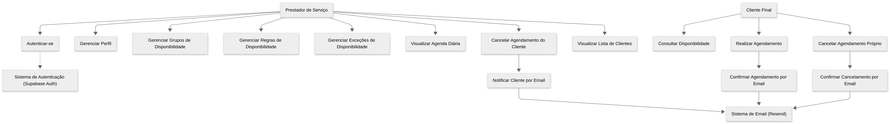

# Modelagem de Processos

## Diagrama de Casos de Uso (UML)

### Atores

- `Prestador de Serviço` (Primário)
- `Cliente Final` (Primário)
- `Sistema de Autenticação` (Secundário - Supabase Auth)
- `Sistema de Email` (Secundário - Resend)

---

### Os Casos de Uso

### Ator: Prestador de Serviço

- **`Autenticar-se`**
    - (Se estende: `Sistema de Autenticação`)
- **`Gerenciar Perfil`**
    - (Editar nome, telefone, e o `public_slug`)
- **`Gerenciar Grupos de Disponibilidade`**
    - (CRUD na `AvailabilityRuleGroup`. Criar/Nomear/Ativar/Desativar "Horário Comercial", "Fim de Semana", etc.)
- **`Gerenciar Regras de Disponibilidade`**
    - (CRUD na `AvailabilityRule`. Definir os intervalos `start_time` / `end_time` para os dias da semana *dentro* de um grupo. A sua UI de "adicionar intervalo" que eu consertei.)
- **`Gerenciar Exceções de Disponibilidade`**
    - (CRUD na `AvailabilityOverride`. O "vermelhinho". Bloquear um dia/horário específico, ou liberar um horário extra).
- **`Visualizar Agenda Diária`**
    - (Esse é o "Gerenciar horários". É um caso de uso de **LEITURA** complexa que junta Regras, Exceções e Agendamentos pra mostrar os botões cinza/escuro/vermelho).
- **`Cancelar Agendamento (do Cliente)`**
    - (Mudar o `status` do `Appointment` para `CANCELLED`).
    - (Inclui: `Notificar Cliente por Email` -> `Sistema de Email`)
- **`Visualizar Lista de Clientes`**
    - (Um `SELECT` na tabela `Client` filtrando quem já agendou com ele).

### Ator: Cliente Final

- **`Consultar Disponibilidade`**
    - (Acessa o `public_slug`, vê a agenda pública).
- **`Realizar Agendamento`**
    - (Escolhe horário, preenche dados. `INSERT` na `Client` e `Appointment`).
    - (Inclui: `Confirmar Agendamento por Email` -> `Sistema de Email`)
- **`Cancelar Agendamento (Próprio)`**
    - (Acessa o link com `cancellation_token` do email).
    - (Inclui: `Confirmar Cancelamento por Email` -> `Sistema de Email`)