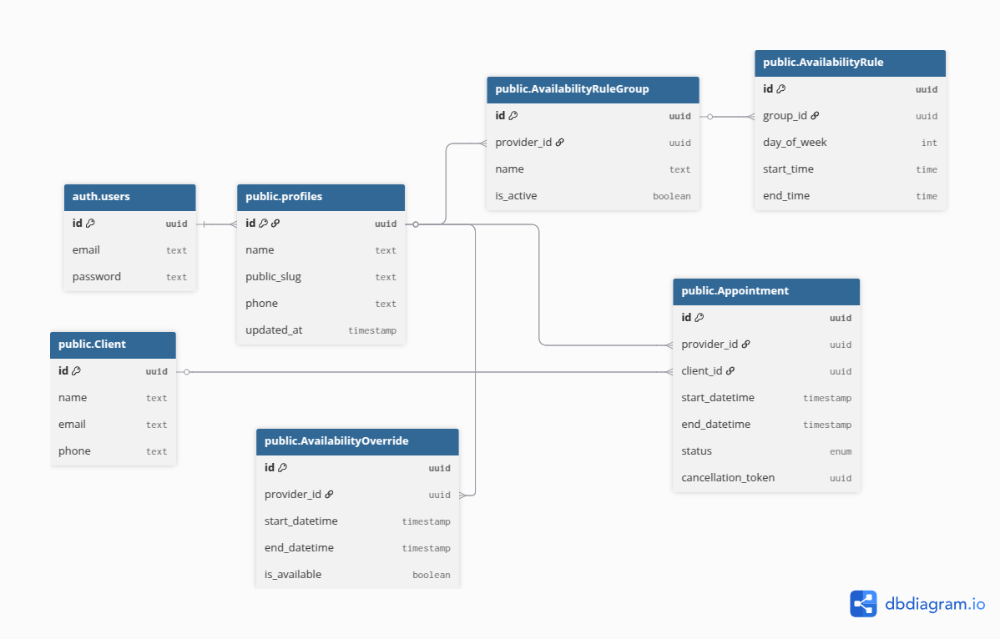

# Modelagem de Dados

## **Diagrama de Entidade-Relacionamento (DER)**

### **1. auth.users (Tabela do Supabase)**

- Onde o id (uuid), email, password do prestador são guardados.

### **2. profiles (Dados do Prestador)**

- id (uuid, PK) - **Chave Estrangeira (FK) para auth.users.id**.
- name (text)
- public_slug (text, unique) - (Ex: "luciane-nails", para o link público do cliente)
- phone (text, nullable)
- updated_at (timestamp)

**Política de RLS (Row Level Security) genial:**

- **SELECT:** auth.uid() = id (O prestador SÓ PODE ler o seu próprio perfil).
- **UPDATE:** auth.uid() = id (O prestador SÓ PODE editar o seu próprio perfil).

### **3. AvailabilityRuleGroup**

Os nomes dos grupos de horário (Ex: "Horário Comercial").

- id (uuid, PK)
- provider_id (uuid, FK para profiles.id)
- name (text)
- is_active (boolean, default: false) - O *toggle* que o prestador liga/desliga.

**Política de RLS:**

- **SELECT/INSERT/UPDATE/DELETE:** auth.uid() = provider_id (O prestador SÓ PODE gerenciar os *seus* grupos de regras).

### **4. AvailabilityRule (Os Intervalos)**

Os intervalos de tempo dentro de um grupo.

- id (uuid, PK)
- group_id (uuid, FK para AvailabilityRuleGroup.id)
- day_of_week (int) - (1 = Segunda, 2 = Terça, ..., 7 = Domingo)
- start_time (time) - (Ex: '09:00:00')
- end_time (time) - (Ex: '12:00:00')
- **CONSTRAINT:** UNIQUE(group_id, day_of_week, start_time) (Impede o prestador de colocar "Segunda 9h-12h" duas vezes no *mesmo* grupo).

**Política de RLS:**

- **SELECT/INSERT/UPDATE/DELETE:** EXISTS (SELECT 1 FROM "AvailabilityRuleGroup" WHERE "AvailabilityRuleGroup".id = group_id AND "AvailabilityRuleGroup".provider_id = auth.uid()) (O prestador SÓ PODE mexer em regras que pertencem a um grupo que é dele).

### **5. Client (Clientes)**

Onde ficam os clientes.

- id (uuid, PK)
- name (text)
- email (text, unique)
- phone (text)

**Política de RLS:**

- O prestador (autenticado) precisa ler, mas o cliente (anônimo) precisa *escrever* (ao criar).
- **INSERT (Cliente):** true (Qualquer um pode se inserir. O backend precisa cuidar para não duplicar email).
- **SELECT (Prestador):** EXISTS (SELECT 1 FROM "Appointment" WHERE "Appointment".client_id = id AND "Appointment".provider_id = auth.uid()) (O prestador SÓ PODE ver clientes que têm agendamento com ele).

### **6. AvailabilityOverride (Exceções)**

Bloqueios (férias) ou horários extras.

- id (uuid, PK)
- provider_id (uuid, FK para profiles.id)
- start_datetime (timestamp)
- end_datetime (timestamp)
- is_available (boolean) - false = bloqueio (vermelho), true = extra.

**Política de RLS:**

- **SELECT/INSERT/UPDATE/DELETE:** auth.uid() = provider_id (O prestador SÓ PODE gerenciar as *suas* exceções).

### **7. Appointment (Agendamentos)**

O registro final.

- id (uuid, PK)
- provider_id (uuid, FK para profiles.id)
- client_id (uuid, FK para Client.id)
- start_datetime (timestamp)
- end_datetime (timestamp)
- status (enum: 'CONFIRMED', 'CANCELLED')
- cancellation_token (uuid, unique)

**Política de RLS:**

- **SELECT (Prestador):** auth.uid() = provider_id (O prestador vê todos os seus agendamentos).
- **INSERT (Cliente):** true (Qualquer um pode tentar criar. A sua API/Função de Borda do Supabase é que tem que ter a lógica de transação e verificação de horário. **Não deixe o RLS fazer isso sozinho**).
- **UPDATE (Cliente):** EXISTS (SELECT 1 FROM "Appointment" WHERE id = "Appointment".id AND "Appointment".cancellation_token = request.headers.token) (Isso é mais complexo, mas o cliente SÓ PODE cancelar com o token certo).