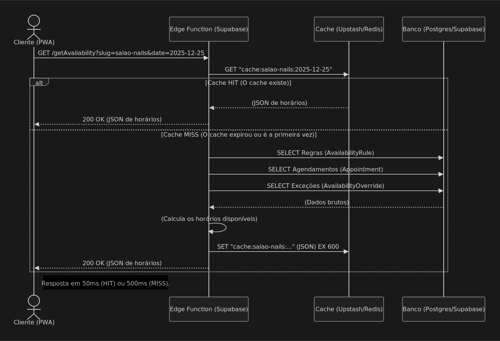
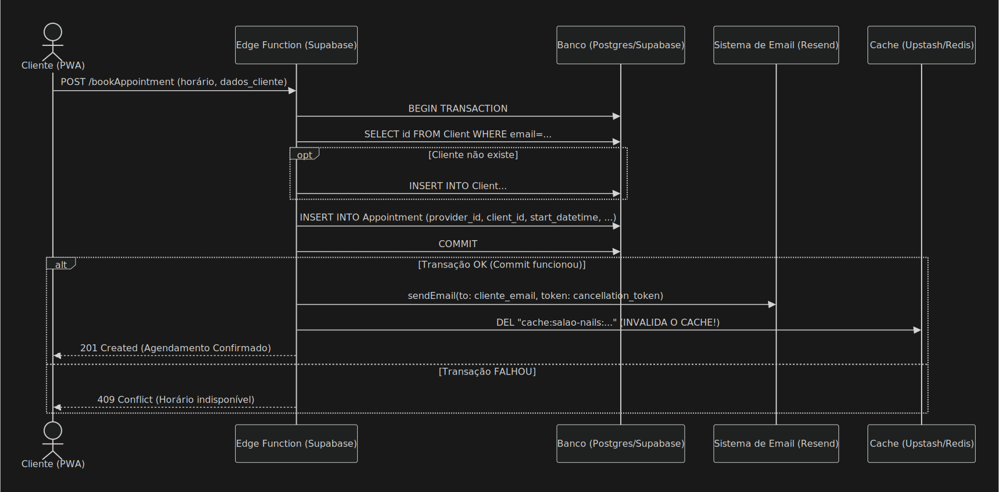
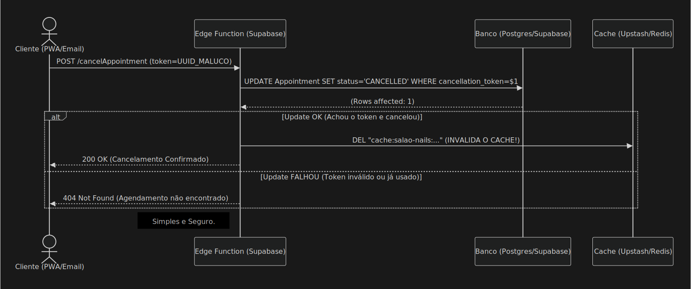

# **Diagramas de Sequência**

### 1. Fluxo de Consulta de Disponibilidade (O CLIENTE)

Esse é o fluxo mais importante. É onde a arquitetura de **CACHE-FIRST** faz você economizar milhões em banco de dados e ser rápido.

### 2. Fluxo de Realizar Agendamento (O CLIENTE)

Para realizar o agendamento via ser utilizada uma **TRANSAÇÃO ACID** dentro da Edge Function.

### 3. Fluxo de Cancelamento (Pelo CLIENTE)

Esse tem que ser simples e seguro. Não apresenta login, apenas o `cancellation_token.`
