# Diagrama Arquitetural

1. **Os Clientes (PWA):** Prestador e Cliente. Eles carregam a casca do PWA a partir da **Vercel**.
2. **O Login (Auth):** O Prestador bate no **Supabase Auth** para se identificar. O Auth da um token (JWT) pra ele.
3. **O Cérebro (Supabase Edge Functions / API):** **TUDO** passa por aqui. O PWA nunca fala direto com o banco ou com o cache.
    - Quando o Cliente pede disponibilidade (`getAvailability`), ele bate na **API**.
    - Quando o Cliente agenda (`bookAppointment`), ele bate na **API**.
    - Quando o Prestador muda uma regra, ele bate na **API** (usando o token JWT do Auth).
4. **A Coreografia da API:**
    - **Fluxo de Leitura:** A **API** pergunta primeiro ao **Cache (Upstash)**. Se o cache falhar (MISS), a API pede ao **Banco (Postgres)**, e depois salva no cache (`Cache-First`).
    - **Fluxo de Escrita:** A **API** executa a lógica de negócio (Transação ACID) *dentro* do **Banco (Postgres)**.
    - **Fluxo de Notificação:** Depois da escrita, a **API** manda o **Resend** enviar o email.
    - **Fluxo de Invalidação:** Depois da escrita, a **API** manda o **Cache (Upstash)** apagar a chave (`DEL cache:...`), forçando uma leitura nova.
5. **A Segurança (RLS):** O **Supabase RLS** fica *dentro* do banco. O RLS impede o Prestador A de ver os dados do Prestador B. O `Auth` guarda os dados, e o `RLS` garante que só seja mostrado o que pertence a cada prestador.

